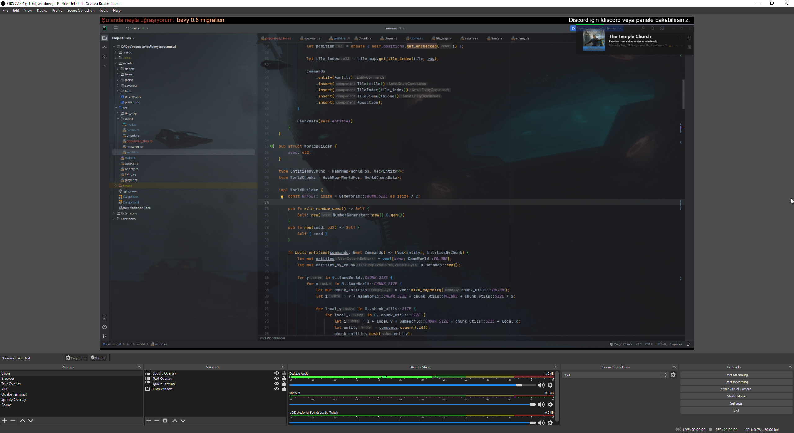

# OBS Spotify Overlay

This is a browser app to be used with OBS to show off what you listen to using Spotify.
Don't forget that streaming music with a copyright can result in strikes on your account.
This isn't legal advice, so it is advised to use it only to show off what you listen to,
without streaming the music.

# Setup
- Clone the repository.
- Copy ``.env.local.example`` as ``.env.local``.
- Fill your Spotify App info into ``.env.local``. **This is only suggested for local or private apps. If you
  plan on making this public, that requires a different setup and some edits to this project. So, it isn't suggested
  or supported.**
- Build it with ``npm run build``.
- Serve it any way you like.
- Add served URL with route ``/calback`` as *redirect URL* into your Spotify App.
- Open the app on the browser, generate an auth link and copy it.
- Use copied link in the OBS browser element.

# Quick/Opinionated Setup
- Install one of the recent Node versions.
- Clone the repository.
- Copy ``.env.local.example`` as ``.env.local``.
- Fill your Spotify App info into ``.env.local``.
- Open a shell (cmd/pwsh/bash) in the directory of the repository.
- Build it by running ``npm run build``.
- Install ``serve`` globally by running ``npm i -g serve``.
- Serve it by running ``serve -s build -l 4091``.
- Add ``http://localhost:4091/callback`` as *redirect URL* into your Spotify App.
- Open ``http://localhost:4091`` on the browser, generate an auth link and copy it.
- Use copied link in the OBS browser element.
- It only works while it is *served*, keep that in mind and don't forget to update
  the generated link between sessions.
